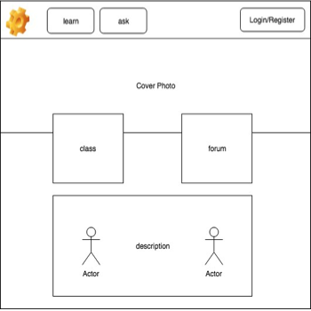
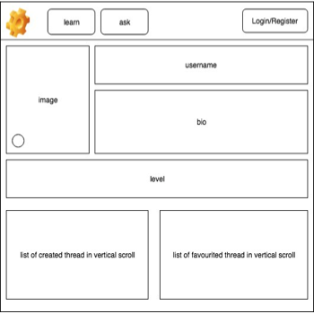
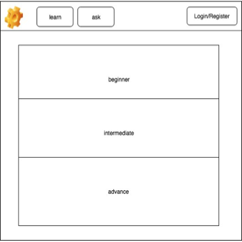
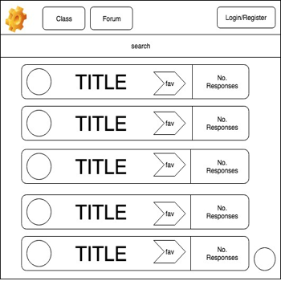
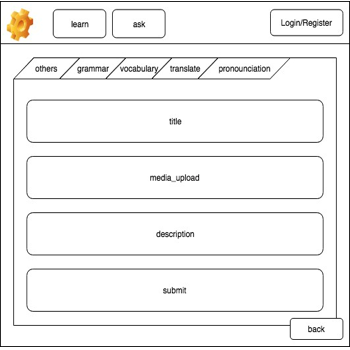
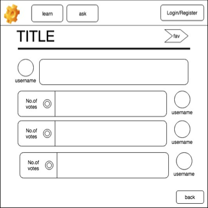

# MalayMe

[MalayMe](https://malayme.herokuapp.com/) is a language learning platform to help users learn Malay. The site contains two main features. The first being a library of usesul videos teaching the language. The other being a Q&A platform where users can ask others questions regarding the language, encouraging a community based learning. This project was built in Ruby using Ruby on Rails Framework, Semantic UI, jQuery and PostgreSQL.

This is a collaboration project by [me](https://github.com/saufm68), [Chloe](https://github.com/ChloeLiang) and [D Sen](https://github.com/wandsen). Please visit our github profiles to see our other projects.

## Wireframes
These are the initial wireframes for the application. The wireframes were donne on draw.io. As we progressed further into the project, we decided to change certain features in the final outcome to make it look more appealing.

## Getting Started
These instructions will help you clone the project and get it running on your local machine.

### Prerequisites
1. Install Ruby on Rails
2. Install PostgreSQL
3. Create a Cloudinary account

### Setting Up 
--

--

